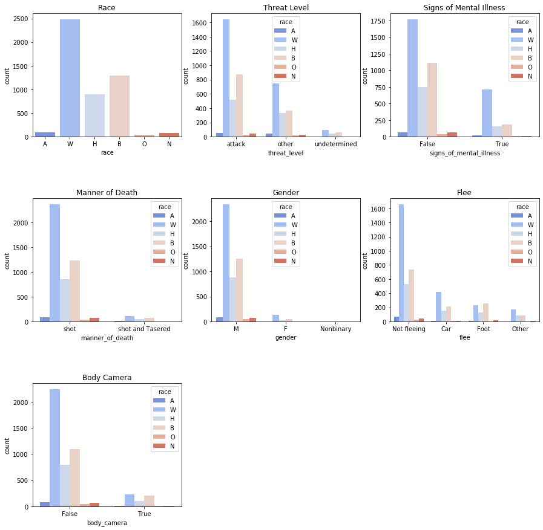
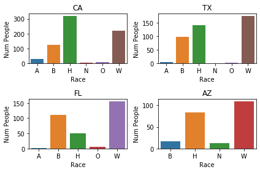
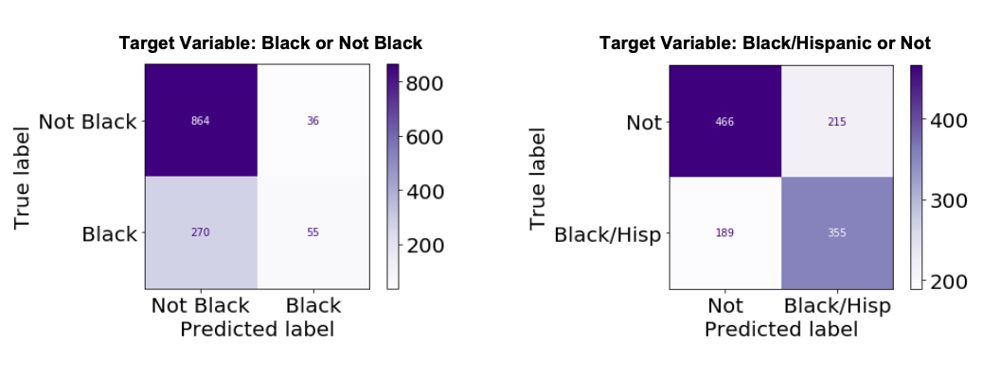
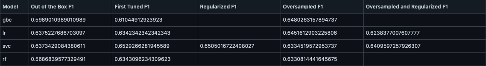

# Problem Identification and Data Collections

 The death of George Floyd while restrained by a police officer has renewed calls for police reform, policy changes, and nation-wide regulations to reduce the number of victims of police shootings. Using collected data on people killed by people, what are the common factors of the fatal encounters that police have with Black and Hispanic victims? I use classication models to predict the race of the victims based on the circumstances and observe which factors are decisive in predicting Black and Hispanice deaths. 
 
There are several sites that collected data on people killed by police, some are crowdsourced and retroactively added when collectors become apprised of the shooting with some information imputed. The Washington Post is a database updated in real-time from its founding, only documenting people who were shot by on-duty police officers (which would exclude George Floyd from this database). Due to its reliable sourcing and real-time updates, I use the Post’s police shootings database for my modeling and explorations.

The database is available here: ​https://github.com/washingtonpost/data-police-shootings

# Data Cleaning and Feature Engineering

Missing values:

The Police Shootings database included some missing values for the ‘armed’ status, the race, the age, and the ‘flee’ status of some entries. Since the model is intended to test for race, it is crucial that the training data includes the race of the person who was killed, so these entries were removed.

For the ‘armed’ feature, there already existed a value for ‘undetermined’ so null entries were given that same value. Similarly, the ‘flee’ feature already included an option for ‘other,’ so null entries were similarly designated. The null values for age were imputed with the mean age of all entries.

In the gender category, there is one null value. After researching the name and city of this shooting, I discovered this victim identified as ‘Nonbinary’ and so was given this value.

Creating features:

Because the ‘armed’ column included 91 unique entries, I created an ‘other’ category to contain any object mentioned less than 20 times. These included odd objects like ‘shovel’, ‘air conditioner’, and ‘screwdriver.’

Using the ‘date’ column, I created features related to the timing of the incident including ‘day_of_week,’ ‘month’, and ‘season.’

Once all new features had been extracted, I transformed all my categorical features into binary encoded columns. Since readability of feature importances is my major objective, I used dummy encoding without dropping the first variable. While this creates some collinearity between the features, it also will allow important features to be clearly represented when plotting importances. The categorical features that I transformed included: ‘gender,’ ‘flee’, ‘armed’, ‘manner of death’, ‘threat_level’, ‘body_camera’, and ‘signs_of_mental_illness.’

Finally I split my data into testing and training sets. Since the majority of my columns now contained just 1’s and 0’s, I standardized the age column to have a mean 0 and a standard deviation 1. I fit the scaler on the training data and used this scaler to transform both the training and testing datasets.

# EDA

When comparing the proportion of people killed by race to the proportions of people in each “threat_level” category, “signs of mental illness” category, gender, “flee” category, and so on, the distribution appears to mirror the overall distribution of White, Black, Hispanic, Asian, Native American, and ‘Other’ people.

More likely is the variation among the states of people killed. Some states like California and Texas have much higher number of police shootings than others like Vermont or Rhode Island. Initial exploration of the data showed the proportion of Black and Hispanic people in higher proportion than the above graphs showed. Variation was also much more apparent in the numbers of victims of difference races among the states.

# Modeling

Which Target Variable to Choose?

The conversation about police shootings and use of force sometimes refers to Black citizens and sometimes to ‘Black and Brown’ citizens as being disproportionately affected. Although I originally wanted to narrow in on Black victims, my initial models performed very poorly when only looking for Black people.

In the confusion matrix on the right, the diagonal squares are darkest, showing the race has been assigned correctly more than it’s been assigned incorrectly. Since all models performed much better on this second dataset, I focused on tuning and interpreting models on the “Black/Hispanic” target variable.

Model Results

After testing SVM, Logistic Regression, Gradient Boosting Classifier, and Random Forest models on the chosen dataset, models were better than the dummy classifier by 15-20%. No model’s performance was particularly impressive, but the best performing models--SVM and Logistic Regression--listed similar features as important in their predictions, the majority of which were specific states.

Based on the initial performances of these models, my recommendations would highlight state-specific differences that are correlated with the high numbers of Black and Hispanic people who are killed by police. That is, it is not circumstantial details like what arm the person was or was not holding or whether they were fleeing that distinguishes how police treat people of different races, but more likely regional factors relating to the specific state’s population.

# Further Research

Next iterations of these models should include state specific details, like total population, racial diversity of the state, population density, poverty rate, diversity of police force, and other regionally specific details that may offer better model performance and more specific features to highlight and perhaps direct policy changes.
